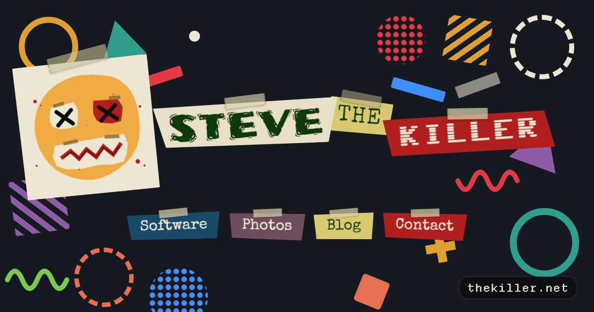

  

Personal site for Steve the Killer - field tech, analog film enthusiast, homelab operator.

Built with [Hugo](https://gohugo.io) and the [Terminal theme](https://github.com/panr/hugo-theme-terminal).  
Deployed via GitHub Actions to GitHub Pages.

The software page is synchronized before every deployment. `scripts/sync-software.py`
reads the latest GitHub release for each Windows app, counts its shipped languages and
themes, records the EXE size, and downloads the selected screenshots from the app's
public website. The workflow also runs hourly as a backup, and each app release script
requests an immediate refresh after publishing a release.
